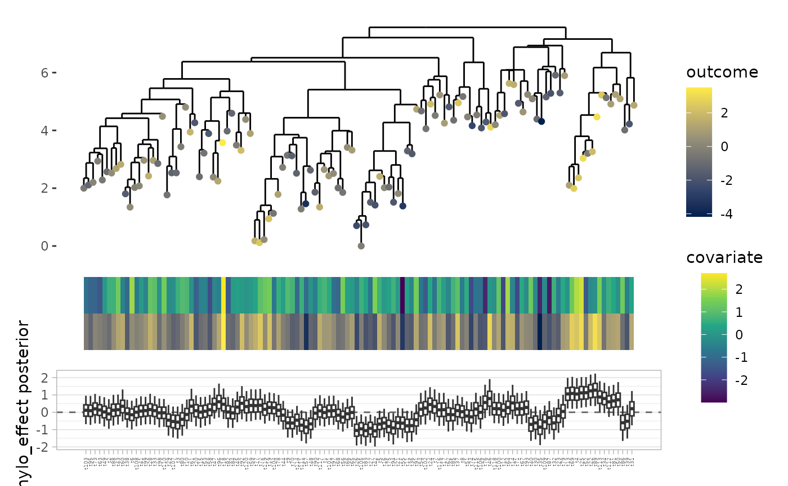

# Advanced Topics

The devil is in the details.

## Genome comparisons

Sometimes then gene model gives too many hits from a single bug. This
can happen if two conditions are met:

- the upstream definition of the genes present in the species is overly
  broad, improperly clumping multiple distinct sub-species into the same
  species
- one or more of these sub-species is confounded with the outcome

This will cause all of the genes characteristic of the sub-species to
show up as significantly associated with the outcome. That is true in
the statistical sense, but it’s not a helpful result when looking for
potentially causal genes.

The function
[`plot_genome_intersections()`](https://andrewghazi.github.io/anpan/reference/plot_genome_intersections.md)
can be used to plot overlaps of genes across isolate genomes in a
unistrain files (which are used to define which genes belong to which
species in the upstream gene profiling step). Multiple distinct blocks
(as shown in the sample below) can cause the problematic “too many hits”
phenomenon described above.

``` r
unistrain_path = "/path/to/g__Faecalibacterium.s__Faecalibacterium_prausnitzii.unistrains.tsv.gz"
plot_genome_intersections(unistrain_path)
```


Another method for detecting this phenomenon is to compute a phylogeny
based on the gene profiles (see the [Estimating phylogenies from gene
matrices](#estimating-phylogenies-from-gene-matrices) section), then
look for a large-scale, species-wide pattern in the distribution of
phylogenetic effects.

We leave the approach to handling this to the user. If the blocking is
driven by a single outlier genome, it may make sense to remove the genes
unique to that outlier. More complicated cases like the example shown
above may require more ad hoc measures, such as separating out the
separate genomes and running them through the gene model separately.

## Splitting merged HUMAnN outputs

HUMAnN UniRef90 profiles may contain all species merged into a single
huge tsv. `anpan` includes a small shell script that will split a file
like this into the per-bug files that are needed to run the gene model.
You can find this script on your system like so:

``` r
system.file('fsplit', package = 'anpan')
```

    ## [1] "/tmp/RtmpdwEm5c/temp_libpath45636af9978e/anpan/fsplit"

Depending on how you installed the package, you may need to
`chmod +x /path/to/fsplit` in order to give it execute access.

In a shell (not R) would then navigate to your big
`merged_humann_output.tsv` and run

    /path/to/fsplit merged_humann_output.tsv

This will:

1.  create an output folder called `merged_humann_output_split/`
2.  create an output file for each unique bug in the input
3.  add the original header line to each
4.  then scan the input with `awk` and append each line to the
    appropriate bug-specific file

It will probably take a few minutes for large input files. The split
output folder can then be used as the `bug_dir` argument in
[`anpan_batch()`](https://andrewghazi.github.io/anpan/reference/anpan_batch.md).

The identifiers in the first column of the input must be formatted as
`gene_id|bug_id`
e.g. `UniRef90_A0A009H1T1|g__Escherichia.s__Escherichia_coli`

Lines corresponding to overall gene abundance (where the first column is
just `gene_id`) or where the taxa is `unclassified` are discarded. The
`fsplit` script isn’t *too* complicated, so if you’re reading this you
can probably figure out how to tweak it if you need those.

## Horseshoe gene model

The default model type for the gene model runs a simple glm for every
gene in every bug, then FDR corrects the p-values after the fact. While
conceptually and computationally simple, this approach has a few
disadvantages:

- the dependence between genes is ignored
- the gene coefficients are unregularized
- the coefficients for additional covariates (e.g. age, gender) get
  estimated repeatedly separately estimated for each gene, increasing
  the chances of identifying non-impactful genes as hits because they’re
  confounded with one of the covariates

By setting `model_type = "horseshoe"` in a call to
[`anpan()`](https://andrewghazi.github.io/anpan/reference/anpan.md), it
is possible to use a “regularized horseshoe” model instead. This type of
model is described in detail in @piironen_sparsity_2017. Basically,
instead of running many small models then FDR correcting, it fits a
single model per bug. This has a number of advantages:

- the coefficients for additional covariates (e.g. age, gender) are only
  estimated once, reducing the chance of finding genes that are
  confounded with covariates
- the horseshoe incorporates the strong prior knowledge that only a very
  small proportion of bacterial genes will affect the outcome
- the strong regularization from the horseshoe will tend to pick out the
  most explanatory genes from sets of collinear genes (if the effects
  are sufficiently identifiable)

The horseshoe model does this by fitting a single regression model that
includes all genes as predictors (as well as any additional covariates
like age and gender), with a regularized horseshoe prior on the gene
coefficients.

A full explanation of the regularized horseshoe is available in
@piironen_sparsity_2017. The coefficients for the genes $`\beta_j`$ use
the following model:

\$\$\beta_j \vert \lambda_j, \tau , c \sim N\left(0 , \tau^2
\tilde{\lambda}^2_j \right) \\ \tilde{\lambda}^2_j = \frac{c^2
\lambda^2_j}{c^2 + \tau^2\lambda^2_j} \\ \lambda_j \sim
Cauchy^+(0,1)\$\$

- $`\lambda_j`$ are gene-wise (local) shrinkage parameters
- $`\tau`$ is a global shrinkage parameter
- $`c`$ controls the degree of regularization on non-zero coefficients

The Stan code used under the hood is adapted from code originally
produced by the `brms` package (@burkner_brms).

``` r
anpan(model_type = "horseshoe")
```

The outputs of this model will look largely the same as
`model_type = "fastglm"` except:

- there are no p-/q-values
  - and hence no significance stars on the plot
- there are typically far fewer hits
- the error bars on non-zero coefficients are usually very wide
- the output includes MCMC convergence statistics

The main disadvantage of the horseshoe model is that it is much more
computationally expensive.

## Repeated measures models

If you have data with multiple samples per subject, you can run a
subject-wise gene model using
[`anpan_repeated_measures()`](https://andrewghazi.github.io/anpan/reference/anpan_repeated_measures.md),
and a subject-wise PGLMM using
[`anpan_subjectwise_pglmm()`](https://andrewghazi.github.io/anpan/reference/anpan_subjectwise_pglmm.md).
These functions require providing a `subject_sample_map` data frame
listing the `subject_id` that goes with each `sample_id`.

[`anpan_repeated_measures()`](https://andrewghazi.github.io/anpan/reference/anpan_repeated_measures.md)
performs the standard anpan filtering on all samples, then uses the
subject-sample map to compute the proportion of samples with the bug.
This gives a gene *proportion* matrix (instead of a presence/absence
matrix) which is then passed to
`anpan_batch(..., filtering_method = "none", discretize_inputs = FALSE)`.

If you have a dataset where multiple samples come from the same
individual, running a PGLMM on all the samples without accounting for
this will return a strong, spurious signal because samples from the same
individual will (usually) be right next to each other on the tree and
all show the same outcome value.
[`anpan_subjectwise_pglmm()`](https://andrewghazi.github.io/anpan/reference/anpan_subjectwise_pglmm.md)
aggregates samples by subject to derive a subject-wise correlation
matrix, then runs a PGLMM on that.

Both of these functions aggregate covariate/outcome metadata by subject
when applicable. Numerical covariates are averaged, while character,
logical, and factor covariates are tabulated, with the most common value
selected as the representative. Ties can be re-ordered with factor
levels.

## Estimating phylogenies from gene matrices

If you don’t have a phylogeny for your data, you can get a very rough
estimate in the following manner:

``` r
gene_tree = gene_pres_abs_matrix |> 
  pca() |>
  stats::dist() |> 
  ape::nj() # or ape::fastme.bal() or ape::bionj()
```

This process is sub-optimal in a number of ways (the gene matrix is low
signal, Jaccard dissimilarity isn’t the most thoughtful thing to use
here, the correlation matrices can end up close to the identity, tree
distance is based on functional profile similarity instead of real
evolutionary relatedness, etc), but it will give you *something* that
you can pass to
[`anpan_pglmm()`](https://andrewghazi.github.io/anpan/reference/anpan_pglmm.md).
Identifying which genes explain which branching points is left as an
exercise for the reader.

The code chunk above won’t run out of the box, you’ll need to plug in
your own matrix and `pca()` function.

If your gene measurements are noisy, it can also be helpful to run some
sort of dimension reduction (e.g. PCA) on the input to the
[`dist()`](https://rdrr.io/r/stats/dist.html) function in case the noise
in your input matrix is overwhelming phylogenetic differences. The
number of principle components to use is debatable, but choosing based
on how the of proportion of variance explained dies off can be
reasonable. One might choose eigenvalues up to the first eigenvalue that
is less than one tenth of the first eigenvalue.

That being said, it’s preferable to estimate phylogenies from the raw
data themselves using any of the many tools available in the literature
(e.g. [StrainPhlAn](https://huttenhower.sph.harvard.edu/strainphlan))
rather than doing something *ad hoc* from the gene matrices. There is a
rich literature on the topic of phylogeny estimation, but the topic
falls outside the scope of anpan. The preceding code block is mainly
intended as a quick-and-dirty, “good enough” method to get a quick look
at how relatedness affects the outcome overall.

## Offset variables

[`anpan_pglmm()`](https://andrewghazi.github.io/anpan/reference/anpan_pglmm.md)
is able to take a single variable from the metadata and use it as an
“offset”. See `?offset()` for additional description. Basically, an
offset is a variable to be included as a covariate, but the coefficient
is known to be exactly 1. The coefficient is not estimated as part of
the model. If a given observation has an offset of +0.5, the linear
predictor for that observation goes up by +0.5.

Categorical offsets can also be used with binary outcomes, in which case
the offset value is taken as the logit(proportion) of the outcome
variable by category. In data.table it’s roughly
`model_input[, offset_value := logit(mean(outcome)), by = offset]`. For
example an observation from a study with 85% cases will start off with a
linear predictor of logit(0.85) = 1.73 before the terms for the global
intercept & other covariates get added on.

We originally developed this functionality for `study_id` variables. The
proportion of cases in a given study isn’t really an uncertain quantity,
it’s something set by the study designers. So if you want to include one
study with mostly cases and another with mostly controls, it makes sense
to build that difference into the model without adding additional
parameters to estimate. You can set `offset = "study_id"` in the call to
[`anpan_pglmm()`](https://andrewghazi.github.io/anpan/reference/anpan_pglmm.md)
and it will estimate the proportions and display them in a message.

Offsets show up on the color bars on plots after the covariates. They’re
always on a continuous scale because the offset value is always a
continuous number.

## Picking out clade members

This section not done

## Tweaking patchwork plots

Most of the theme parameters used in anpan’s plotting functions are set
to reasonable defaults, but sometimes real data makes the plots look a
bit wonky. Take the PGLMM posterior plot we generated in the \[PGLMMs\]
section:

    ##           elpd_diff se_diff
    ## pglmm_fit   0.0       0.0  
    ## base_fit  -11.8       4.0



The labels are a bit too small. Another common problem with these plots
is that for large datasets the tree gets too crowded to see the
individual tips.

These can mostly be addressed after the fact with the usual means of
altering ggplot. However, many of the plots produced by anpan are
composite figures produced by the
[patchwork](https://patchwork.data-imaginist.com/index.html) package.
This adds an additional step to tweaking the plots and making them
publication ready. `patchwork` plots can essentially be accessed as a
list with the sub-plots as elements. So the code block below shows three
common modifications:

- make the lines thinner on the tree (first sub-plot)
- make the labels bigger and left-justified on the posterior box plots
  (third sub-plot)
- make the points bigger on the tree

``` r
# Thinner lines on the tree
p[[1]]$layers[[1]]$aes_params$size = .2

# Make the sample labels bigger
p[[3]]$theme$axis.text.x = element_text(size = 4.5, angle = 90, hjust = 0)

# Make the points bigger
p[[1]]$layers[[2]]$aes_params$size = 3

p
```


The details of finding which theme/aes parameters that are needed for
additional tweaks are left as an exercise for the reader, but generally
typing a dollar sign on a sub-plot `p[[2]]$`, then looking at the names
suggested by RStudio auto-complete can get you pretty far.

You can also use the sub-plot accessor to pull out sub-plots that can
then be rearranged in new ways with
[`patchwork::plot_layout()`](https://patchwork.data-imaginist.com/reference/plot_layout.html).
We have occasionally made huge mega plots with something like the code
chunk below.

    outcome_tree + 
    effect_boxplots + 
    gene_heatmap + 
    half_correlation_matrix + 
    plot_layout(ncol = 1)

### Editing color bar palettes

The palettes used in the color bar can be edited by setting the
appropriate scale on the patchwork object. Below I give an example where
I change the colors used for gender on the color bar from red/blue to
purple/green. With some slight edits to this you could change the color
bar on tree plots as well. [This github
exchange](https://github.com/eliocamp/ggnewscale/issues/54#issuecomment-1501951928)
may also be helpful if you’re looking for more information.

``` r
p = plot_results(res         = res,
                 covariates  = c("age", "gender", "study_name"),
                 outcome     = "crc",
                 model_input = mi)


color_bar_i = 1 # the color bar subplot in the patchwork
gender_i    = 4 # the scale used for gender on the plot

p[[color_bar_i]] # this should print the color bar only
p[[color_bar_i]]$scales$scales # examine the list of scales to find the one you need to set gender_i

aes_name = p[[color_bar_i]]$scales$scales[[gender_i]]$aesthetics
guide = p[[color_bar_i]]$scales$scales[[gender_i]]$guide
guide$available_aes = aes_name

p[[color_bar_i]]$scales$scales[[gender_i]] = scale_fill_discrete(aesthetics = aes_name,
                                                                 guide = guide,
                                                                 type = c("purple", "green")) 

p[[color_bar_i]] # Now gender is purple/green
```

## Configuring parallelization and progress reporting

anpan uses the packages [`furrr`](https://furrr.futureverse.org/) and
[`progressr`](https://progressr.futureverse.org/) to parallelize and
show progress on long calculations, respectively. That means that
internally some anpan calculations are written conceptually as “this
code might run in parallel” and “this code might display progress”. The
user can configure the parallelization plan and progress reporting to
their preference.

### `furrr`

See the details on `?future::plan()`, but the most common way to
parallelize is via multisession:

``` r
plan(multisession, workers = 4)
```

This will start up 4 separate R sessions evaluating the appropriate
parallelized code.

The exception to this is
[`anpan_pglmm_batch()`](https://andrewghazi.github.io/anpan/reference/anpan_pglmm_batch.md).
This function parallelizes both over bugs and loo calculations for each
bug, so typically the fastest way to run is to use Stan’s
`parallel_chains` argument to parallelize the MCMC and a so-called
“nested future topology” to parallelize the loo:

``` r
plan(list(sequential, tweak(multisession, workers = 6)))
anpan_pglmm_batch(..., 
                  parallel_chains = 4)
```

This is sequential over bugs but parallelizes the 4 MCMC chains for each
model and parallelizes the loo calculations over iterations. However
depending on the ratio of MCMC time to loo time (and the amount of
memory you have available), it might be faster to use a non-nested
future topology and simply parallelize over bugs.

There are many future configuration methods that I haven’t tried
(e.g. `future.batchtools::batchtools_slurm()`), so let me know how it
goes if you try out something exotic.

### `progressr`

Turning on all global progress reporting is done with this command:

``` r
handlers(global = TRUE)
```

From there, you can set up additional handlers to customize the progress
reporting. My favorite is:

``` r
handlers(handler_progress(format = "[:bar] :current/:total (:percent) in :elapsed ETA: :eta"),
         handler_beepr(initiate = NA,
                       update   = NA,
                       finish   = 1))
```

There are also some that are more exciting:

``` r
# let's do the fork in the garbage disposal!
handlers(handler_beepr(initiate      = NA,
                       update        = 1,
                       finish        = NA,
                       intrusiveness = 1)) 
```

Once you’ve set your preferred handler(s), you can test the reporting
with this command:

``` r
progressr::slow_sum(1:5)
```

## Other anpan functions

This vignette doesn’t overview the usage of every single anpan function
(it’s already too long). Here are the other user-accessible anpan
functions. They *should* each have a help page, and you can of course
ask additional questions on [the bioBakery help
forum](https://forum.biobakery.org/).

    ##  [1] "anpan"                               "anpan_batch"                        
    ##  [3] "anpan_pglmm"                         "anpan_pglmm_batch"                  
    ##  [5] "anpan_pwy_ranef"                     "anpan_pwy_ranef_batch"              
    ##  [7] "anpan_repeated_measures"             "anpan_subjectwise_pglmm"            
    ##  [9] "anpan_vignette"                      "compute_clade_effects"              
    ## [11] "draw_mvnorm"                         "filter_batch"                       
    ## [13] "filter_gf"                           "get_cor_mat"                        
    ## [15] "get_genome_intersect_counts"         "olap_tree_and_meta"                 
    ## [17] "plot_cor_mat"                        "plot_elpd_diff"                     
    ## [19] "plot_genome_intersection_histograms" "plot_genome_intersections"          
    ## [21] "plot_half_cor_mat"                   "plot_lines"                         
    ## [23] "plot_outcome_tree"                   "plot_p_value_histogram"             
    ## [25] "plot_pwy_ranef"                      "plot_pwy_ranef_intervals"           
    ## [27] "plot_results"                        "plot_tree_with_post"                
    ## [29] "plot_tree_with_post_pred"            "read_and_filter"                    
    ## [31] "read_bug"
