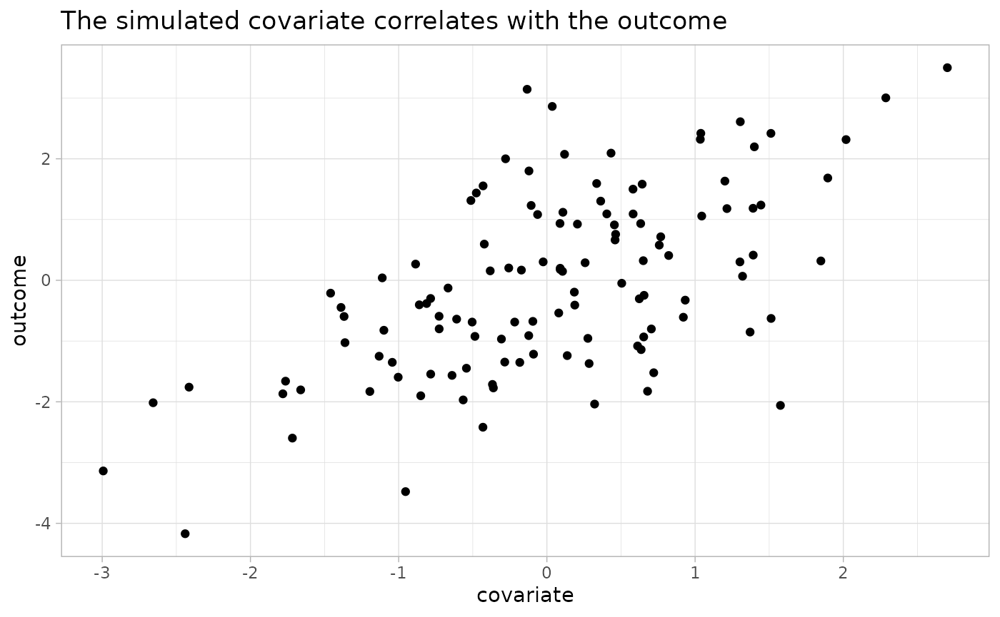
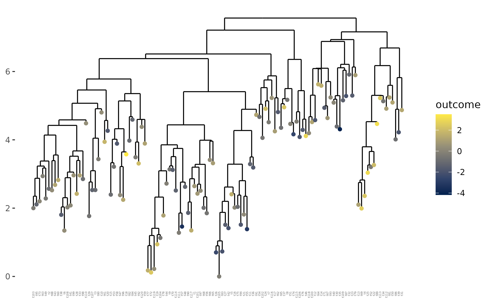
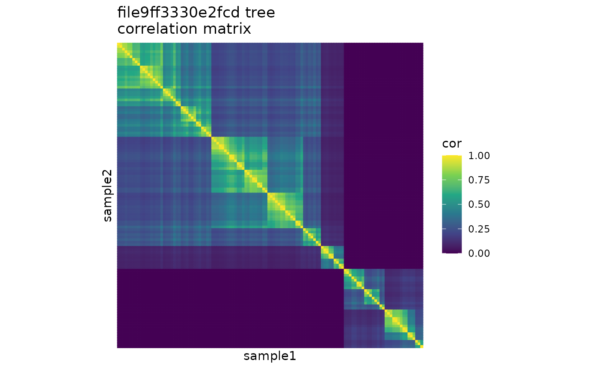
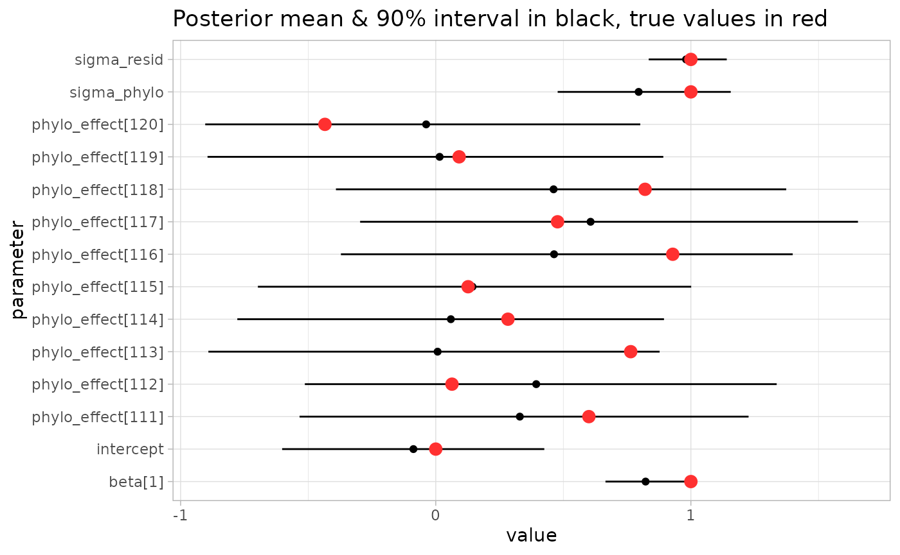
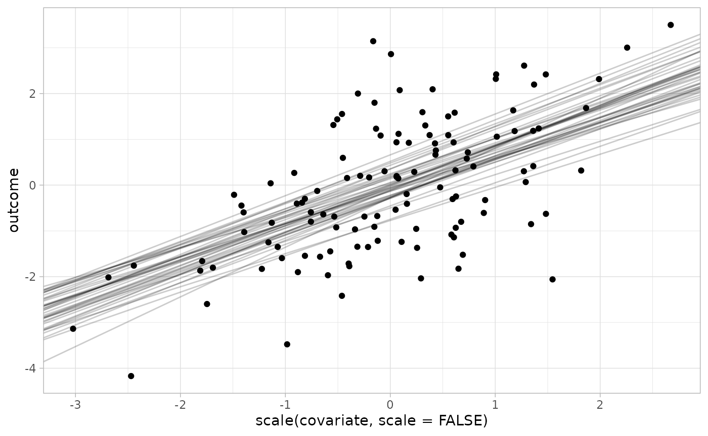

# PGLMMs

## PGLMMs

Phylogenetic generalized linear mixed models (PGLMMs) are probabilistic
models that account for phylogenetic structure. For a PGLMM with a
linear regression as the base model, the model structure is as follows:

``` math
 y = X \beta + (1|\text{leaf}) + \epsilon 
```

``` math
(1|\text{leaf}) \sim \text{MVNormal}(0, σ_p^2\Omega)
```

``` math
\epsilon \sim \text{Normal}(0, σ_R^2)
```

The outcome $`y`$ is modeled as a function of some familiar terms:
covariates $`X`$, coefficients $`\beta`$, and residual noise
$`\epsilon`$. The key addition is the phylogenetic term
$`(1|\text{leaf})`$, which contains a “random effect” for each
observation in $`y`$. Unlike typical random effects (which are usually
independent between different levels of the random effect variable), the
values in the phylogenetic term follow a pre-specified correlation
structure $`\Omega`$, which is derived from a tree. The variability of
the phylogenetic term is scaled by the “phylogenetic noise” parameter
$`\sigma_{phylo}`$.

To understand how a tree implies a correlation structure, consider the
plot below showing a phylogenetic tree and the lower triangle of the
correlation matrix it implies. You can see that the clade on the left
(with low inter-leaf distances between its members) forms a bright
sub-block of high correlation in the matrix. The tiny clade on the far
right has high inter-leaf distance between its members and the rest of
the tree, so its members generally have low correlation with the rest of
the leaves, exhibited by the dark band on the right of the triangle.
Note that the matrix is derived solely from the structure of the tree
(the black lines) – it is not influenced by the colored outcome dots.
The correlation matrix numerically quantifies the “higher inter-leaf
distance → lower correlation” principle.


We can see in the synthetic example above that the tree clearly does
impact the outcome: the two well-separated clades clearly show very
different outcome values. A PGLMM evaluated on this data would easily
detect such a blazing signal, so in the remainder of this section we’ll
simulate a tree with an outcome that’s realistically noisier and less
visually obvious. After that we’ll fit the PGLMM with
[`anpan_pglmm()`](https://andrewghazi.github.io/anpan/reference/anpan_pglmm.md)
then examine the results.

Some setup:

``` r
library(anpan)
```

    ## • This is anpan version 0.3.0
    ## • Read the guide: Reinstall with `build_vignettes = TRUE`, then run
    ## anpan::anpan_vignette()
    ## • Get help: Visit the biobakery help forum at <https://forum.biobakery.org/>
    ## • Parallelize: Run `future::plan()` as appropriate for your system.
    ## • Activate progress bars: `library(progressr); handlers(global=TRUE)`

``` r
library(data.table)
library(ggplot2)
library(tibble)
library(dplyr)
```

    ## 
    ## Attaching package: 'dplyr'
    ## 
    ## The following objects are masked from 'package:data.table':
    ## 
    ##     between, first, last
    ## 
    ## The following objects are masked from 'package:stats':
    ## 
    ##     filter, lag
    ## 
    ## The following objects are masked from 'package:base':
    ## 
    ##     intersect, setdiff, setequal, union

``` r
library(ape)
```

    ## 
    ## Attaching package: 'ape'
    ## 
    ## The following object is masked from 'package:dplyr':
    ## 
    ##     where

``` r
options(digits = 2)
```

### Simulate data

To demonstrate the PGLMM functionality, we’ll simulate a tree, a single
covariate `x`, and an outcome variable `y`. We’ll use `n = 120`,
`sigma_phylo = 1` and `sigma_resid = 1`.

The best way to understand a generative model is to use it to simulate
data. If you feel like you don’t understand PGLMMs, step through these
simulation blocks line by line (10 lines in total), look at the outputs,
and make sure you understand what happens on that line. Try modifying it
in different ways and see how the outputs and downstream inference
change.

The code chunk below sets a randomization seed and the parameters we’ll
use, then generates a random tree:

``` r
set.seed(123)

n = 120
sigma_phylo = 1
sigma_resid = 1

tr = ape::rtree(n)
```

You can try `plot(tr)` if you want to take a quick look at your tree,
but we’ll examine it with some additional detail later.

The chunk below derives the correlation matrix implied by the tree:

``` r
cor_mat = ape::vcv.phylo(tr, corr = TRUE)

cor_mat[1:5,1:5]
```

    ##       t86  t39  t31 t112  t81
    ## t86  1.00 0.77 0.56 0.29 0.30
    ## t39  0.77 1.00 0.58 0.29 0.31
    ## t31  0.56 0.58 1.00 0.33 0.35
    ## t112 0.29 0.29 0.33 1.00 0.93
    ## t81  0.30 0.31 0.35 0.93 1.00

The “t#” labels are the default sample IDs that
[`ape::rtree()`](https://rdrr.io/pkg/ape/man/rtree.html) puts as tip
labels.

The chunk below generates a normally distributed covariate `covariate`
(which has no connection to phylogeny), the linear effect of that
covariate `linear_term`, the true phylogenetic effects we’ll use, and
the outcome variable `outcome`, all stored in a tibble called
`metadata`. Note that the effect size of the covariate is explicitly set
to 1:

``` r
set.seed(42)

covariate = rnorm(n)

linear_term = 1 * covariate + rnorm(n, mean = 0, sd = sigma_resid)

true_phylo_effects = sigma_phylo * draw_mvnorm(Sigma = cor_mat)

metadata = tibble(sample_id = colnames(cor_mat),
                  covariate = covariate,
                  outcome   = linear_term + true_phylo_effects)
```

``` r
metadata
```

    ## # A tibble: 120 × 3
    ##    sample_id covariate outcome
    ##    <chr>         <dbl>   <dbl>
    ##  1 t86          1.37    -0.852
    ##  2 t39         -0.565   -1.97 
    ##  3 t31          0.363    1.30 
    ##  4 t112         0.633    0.933
    ##  5 t81          0.404    1.09 
    ##  6 t50         -0.106    1.23 
    ##  7 t113         1.51     2.42 
    ##  8 t34         -0.0947  -0.676
    ##  9 t4           2.02     2.32 
    ## 10 t13         -0.0627   1.08 
    ## # ℹ 110 more rows

Now we have our tree and the metadata that goes along with it. A quick
plot shows that the outcome correlates with the simulated covariate as
desired:

``` r
ggplot(metadata, aes(covariate, outcome)) + 
  geom_point() + 
  labs(title = "The simulated covariate correlates with the outcome") + 
  theme_light()
```



We can use the function
[`anpan::plot_outcome_tree()`](https://andrewghazi.github.io/anpan/reference/plot_outcome_tree.md)
to visually inspect the tree and confirm that it also appears related to
the outcome. The dot on each leaf is shaded according to the outcome:

``` r
plot_outcome_tree(tr,
                  metadata, 
                  covariates = NULL,
                  outcome    = "outcome")
```

    ## Warning: `aes_string()` was deprecated in ggplot2 3.0.0.
    ## ℹ Please use tidy evaluation idioms with `aes()`.
    ## ℹ See also `vignette("ggplot2-in-packages")` for more information.
    ## ℹ The deprecated feature was likely used in the anpan package.
    ##   Please report the issue to the authors.
    ## This warning is displayed once every 8 hours.
    ## Call `lifecycle::last_lifecycle_warnings()` to see where this warning was
    ## generated.



You can sort of see by eye that the phylogeny correlates with the
outcome. Some clades are generally brighter, and close neighbors usually
have about the same shade of color.

How do we *quantitatively* assess the impact of the phylogeny on the
outcome while also building in the relationship with the covariate? Use
a PGLMM.

**Exercise: Change the simulation to produce a binary outcome. Hint: If
you don’t want to define an inverse logit function, you can use
[`stats::plogis()`](https://rdrr.io/r/stats/Logistic.html). You may also
want to use [`rbinom()`](https://rdrr.io/r/stats/Binomial.html) and
start by first simulating a standard logistic regression. The answer is
given in the source Rmarkdown.**

### Fit the PGLMM

The code chunk below shows how to use
[`anpan_pglmm()`](https://andrewghazi.github.io/anpan/reference/anpan_pglmm.md)
to fit a PGLMM that examines this data for phylogenetic patterns while
adjusting for our covariate. It will take a couple minutes to run. By
default `anpan_pglmm` regularizes the noise ratio
`sigma_phylo / sigma_resid` with a Gamma(1,2) prior and runs a
leave-one-out model comparison against a “base” model that doesn’t have
the phylogenetic component. The default `family = "gaussian"` argument
means the residual error is normally distributed. This can be changed to
`family = "binomial"` with a binary outcome to run a phylogenetic
logistic regression.

``` r
result = anpan_pglmm(meta_file       = metadata,
                     tree_file       = tr,
                     outcome         = "outcome",
                     covariates      = "covariate",
                     family          = "gaussian",
                     bug_name        = "sim_bug",
                     reg_noise       = TRUE,
                     loo_comparison  = TRUE,
                     run_diagnostics = FALSE,
                     refresh         = 500,
                     show_plot_tree  = FALSE,
                     show_post       = FALSE)
```



Aside from fitting the model, this command prints a plot (and a lot of
console output with messages about the progression of the MCMC sampler).
This plots shows the correlation matrix implied by the tree. This is how
the PGLMM sees the correlation structure of the leaves. (Side note: the
randomized tree name shows up because we didn’t provide one explicitly
and the function wasn’t able to pull one from the tree input either).

If you want to tl;dr the rest of the PGLMMs section, look at the model
comparison result to decide if the phylogeny is informative beyond the
base model:

``` r
result$loo$comparison
```

    ##           elpd_diff se_diff
    ## pglmm_fit   0.0       0.0  
    ## base_fit  -11.8       4.0

***Leave one out model comparison [is NOT a null hypothesis significance
test.](https://avehtari.github.io/modelselection/CV-FAQ.html#13_When_not_to_use_cross-validation)***

The PGLMM is the best fitting model, the difference in ELPD (predictive
performance score) is relatively large (\> -4), and the difference in
ELPD for the base model is more than two standard errors below zero. So
in this case you can say the phylogeny clearly contributes to the
outcome. Given that we simulated the tree with $`\sigma_{phylo} > 0`$,
that is the correct conclusion.

If you want to see how the fit sees the effect of the tree, you can
examine the posterior distribution on the phylogenetic with a simple
interval plot laid out below the tree using
[`plot_tree_with_post()`](https://andrewghazi.github.io/anpan/reference/plot_tree_with_post.md)
(or leave `show_post` at its default `TRUE` value in the above call to
[`anpan_pglmm()`](https://andrewghazi.github.io/anpan/reference/anpan_pglmm.md)):

``` r
p = plot_tree_with_post(tree_file  = tr,
                        meta_file  = metadata,
                        fit        = result$pglmm_fit,
                        covariates = "covariate",
                        outcome    = "outcome",
                        color_bars = TRUE,
                        labels     = result$model_input$sample_id)
```

    ## Make sure the label order matches the fit object! See ?plot_tree_with_post

``` r
p
```


You can see that the model fit confirms what we observed visually
earlier: the phylogenetic effect generally shifts the outcome up in the
bright clades and tightly correlated neighbors generally have very
similar phylogenetic effects.

But how do we estimate *clade* effects? It’s important to contextualize
the results in terms of the model formulation. A PGLMM doesn’t see the
tree, it sees the correlation matrix $`\Omega`$. Human eyes can easily
pick out blocks in the matrix as discrete clades, but the model sees
only a single, constrained multivariate distribution. So a presentation
like this where the phylogenetic effects are juxtaposed against the tree
is a straightforward way to display of the fitted model, but can’t draw
the sharp dividing lines we might want.

If you are able to justifiably define a clade manually (with some
articulable, non-circular reasoning beyond “this clade looks like it has
a higher outcome”), you can use the function
[`compute_clade_effects()`](https://andrewghazi.github.io/anpan/reference/compute_clade_effects.md)
to compare the average phylogenetic effect of clade members against that
of non-members. However automating the selection of clades is
non-trivial and beyond the scope of this package, so we won’t be
demonstrating that function here.

**Exercise: Fit a PGLMM with a binary outcome. If you weren’t able to
modify the simulation to generate binary outcomes in the previous
exercise, just set the outcome to random draws of TRUE/FALSE (in which
case you should observe zero phylogenetic signal). The answer is given
in the source Rmarkdown.**

### Detailed interpretation

PGLMMs have a lot of moving parts. Let’s look at some of the results
more closely.

#### Messages

A couple points to mention on the messages produced by
[`anpan_pglmm()`](https://andrewghazi.github.io/anpan/reference/anpan_pglmm.md):

- There’s an important startup message that usually gets pushed off by
  later messages:

&nbsp;

    (1/3) Checking inputs.
    Plotting correlation matrix...
    Prior scale on covariate effects aren't specified. Setting to 1 standard deviation for each centered covariate. These values are:
       linear_term prior_sd
            <char>    <num>
    1:   covariate    1.019
    It would be better to set the beta_sd argument based on scientific background knowledge.

This message is stating the empirical priors on the covariate
coefficients which anpan inferred from the data. It’s usually better to
set these yourself based on background information with the `beta_sd`
argument.

- There are messages from Stan about missing init values:

&nbsp;

    Init values were only set for a subset of parameters. 
    Missing init values for the following parameters:
     - chain 1: beta, centered_cov_intercept, std_phylo_effects
     - chain 2: beta, centered_cov_intercept, std_phylo_effects
     - chain 3: beta, centered_cov_intercept, std_phylo_effects
     - chain 4: beta, centered_cov_intercept, std_phylo_effects

These are benign – the randomized initialization that Stan provides
works fine for these parameters.

- There’s a fairly innocuous message from Stan that usually occurs at
  the start of the MCMC chains:

&nbsp;

    Chain 1 Informational Message: The current Metropolis proposal is about to be rejected because of the following issue:
    Chain 1 Exception: normal_id_glm_lpdf: Scale vector is inf, but must be positive finite! (in '/var/folders/g8/22sdpptx451fng3nbj7c45vw0000gq/T/RtmpSaBGri/model-2e4326e878c5.stan', line 37, column 2 to column 62)
    Chain 1 If this warning occurs sporadically, such as for highly constrained variable types like covariance matrices, then the sampler is fine,
    Chain 1 but if this warning occurs often then your model may be either severely ill-conditioned or misspecified.

This means that the noise parameter during one of the warmup iterations
escaped the weak prior and got set to a really large value and the model
didn’t like it. As the message states, this isn’t a problem if it only
occurs sporadically during the warmup iterations. You can check the Stan
outputs or set `refresh = 1` to confirm this, but I’ve personally never
seen this message occur outside of warmup.

#### Elements of the result value

`result` is a list with five elements:

- `model_input` - the input metadata that made it into the analysis
  after taking the samples that overlapped with the leaves of the tree,
  re-ordered to the order of samples given in the correlation matrix.
- `cor_mat` - the correlation matrix derived from the tree
- `pglmm_fit` - a
  [CmdStanMCMC](https://mc-stan.org/cmdstanr/reference/CmdStanMCMC.html)
  object containing the PGLMM fit
- `base_fit` - another
  [CmdStanMCMC](https://mc-stan.org/cmdstanr/reference/CmdStanMCMC.html)
  object containing the “base” GLM fit (without the phylogenetic
  component)
- `loo` - a list containing four elements:
  - `pglmm_loo` - a [loo()](https://mc-stan.org/loo/) result for the
    PGLMM model using integrated importance weights
  - `pglmm_ll_mat` - a matrix giving the integrated log-likelihood
    importance weights with for posterior iterations (rows) of each leaf
    (columns)
  - `base_loo` - a [loo()](https://mc-stan.org/loo/) result for the base
    model
  - `comparison` - a
    [loo_compare()](https://mc-stan.org/loo/reference/loo_compare.html)
    result comparing the two models by leave-one-out predictive
    performance.

The `pglmm_fit` part of the result is the model fit produced by
`cmdstanr` for the PGLMM. Any method applicable to [CmdStanMCMC
objects](https://mc-stan.org/cmdstanr/reference/CmdStanMCMC.html) works
on this, but of particular interest is the
[`summary()`](https://rdrr.io/r/base/summary.html) method which we’ll
use to inspect model fit.

#### Check diagnostics

If you run `anpan_pglmm(run_diagnostics = TRUE)`, the function will run
the diagnostic checking functions for the MCMC and loo results as
applicable. In the example above, the output will look something like
this:

    (4/4) Running diagnostics:
    Processing csv files: /var/folders/g8/22sdpptx451fng3nbj7c45vw0000gq/T/RtmpZqhitZ/cont_pglmm_noise_reg-202211071429-1-59c385.csv, /var/folders/g8/22sdpptx451fng3nbj7c45vw0000gq/T/RtmpZqhitZ/cont_pglmm_noise_reg-202211071429-2-59c385.csv, /var/folders/g8/22sdpptx451fng3nbj7c45vw0000gq/T/RtmpZqhitZ/cont_pglmm_noise_reg-202211071429-3-59c385.csv, /var/folders/g8/22sdpptx451fng3nbj7c45vw0000gq/T/RtmpZqhitZ/cont_pglmm_noise_reg-202211071429-4-59c385.csv

    Checking sampler transitions treedepth.
    Treedepth satisfactory for all transitions.

    Checking sampler transitions for divergences.
    No divergent transitions found.

    Checking E-BFMI - sampler transitions HMC potential energy.
    E-BFMI satisfactory.

    Effective sample size satisfactory.

    Split R-hat values satisfactory all parameters.

    Processing complete, no problems detected.
    Pareto k diagnostic values:
                             Count Pct.    Min. n_eff
    (-Inf, 0.5]   (good)     119   99.2%   720       
     (0.5, 0.7]   (ok)         1    0.8%   1654      
       (0.7, 1]   (bad)        0    0.0%   <NA>      
       (1, Inf)   (very bad)   0    0.0%   <NA>      

    All Pareto k estimates are ok (k < 0.7).
    Warning message:
    Some Pareto k diagnostic values are slightly high. See help('pareto-k-diagnostic') for details.

You can see that the MCMC diagnostics all came out well in this case.
You’ll get a link to the [Stan warnings
guide](https://mc-stan.org/misc/warnings.html) if your sampler hits any
issues. If you do get convergence issues, the two simplest things to try
first are usually setting `adapt_delta` to a higher-than-default value
(e.g. 0.95) and increasing the number of iterations with
e.g. `iter_warmup = 2000` and `iter_sampling = 2000`. Another common
issue is that if you accidentally use `family = "gaussian"` where you
meant `family = "binomial"`, you’ll get E-BFMI warnings.

In the example above we got one ok (but not good) Pareto k value, which
is more-or-less fine. Running more iterations with a higher
`adapt_delta` can sometimes help improve this, but for
[`anpan_pglmm()`](https://andrewghazi.github.io/anpan/reference/anpan_pglmm.md)
the occurrence of bad / very bad Pareto k values are usually more
indicative of a dataset problem than a model problem. Low N, correlation
matrices that are close to the identity, and/or imbalanced binary
outcomes can make it impossible to estimate accurate loo results. The
[Cross-validation
FAQ](https://avehtari.github.io/modelselection/CV-FAQ.html#17_What_to_do_if_I_have_many_high_Pareto_(hat%7Bk%7D)%E2%80%99s)
has more information. The parameter of interest in a PGLMM is really
`sigma_phylo` anyway (see next section), so loo results aren’t
absolutely necessary to assess the impact of the phylogeny on the
outcome. If you aren’t interested in the model comparison, you can just
set `loo_comparison = FALSE` and ignore the issue.

#### Inspect model fit

We’ll use the [`summary()`](https://rdrr.io/r/base/summary.html) method
here to pull out the posterior means for several parameters (black) and
compare them to their true values (red). These parameters include for
the covariate effects `beta`, the `intercept`, residual noise term
`sigma_resid`, the spread of phylogenetic effects `sigma_phylo` and the
per-leaf phylogenetic effects (which are indexed in the same order as
`model_input`):

``` r
post_summary = result$pglmm_fit$summary() |> 
  filter(grepl("beta|^intercept|sigma|^phylo_effect", variable)) |> 
  mutate(true_value = c(1,1,1, true_phylo_effects, 0))

post_summary[-c(4:113),] |> 
  ggplot(aes(mean, variable)) + 
  geom_point() + 
  geom_segment(aes(x = q5, xend = q95,
                   y = variable, yend = variable)) + 
  geom_point(aes(x = true_value), 
             color = 'firebrick1',
             size = 3) + 
  labs(x = 'value',
       y = 'parameter',
       title = 'Posterior mean & 90% interval in black, true values in red') + 
  theme_light()
```



Most of the phylogenetic effects are cut from the plot for the sake of
visibility. We can see that the posterior mean for beta\[1\] (the effect
of the covariate) is fairly close to the true value (1), as are the
intercept (0) and noise terms (1 and 1). Importantly, the 90% posterior
intervals capture the true values.

Another thing to note on the above plot is the posterior interval of
`sigma_phylo`. This parameter is the estimated marginal “spread” of leaf
effects. It’s about 1, and clearly quite far from zero. This means that
leaf effects are allowed to be quite large, depending on where a leaf is
in the tree. If the `sigma_phylo` estimate is near zero, that means leaf
effects are all small, meaning the tree structure doesn’t explain
variation in the outcome well.

So we mostly recaptured our simulation parameters, but how well does the
model really fit the data overall? We can use
[`anpan::plot_tree_with_post_pred()`](https://andrewghazi.github.io/anpan/reference/plot_tree_with_post_pred.md)
to overlay the posterior predictive distribution for each leaf and show
that the predictive distribution for each observation usually covers the
true value:

``` r
anpan::plot_tree_with_post_pred(tree_file  = tr,
                                meta_file  = metadata,
                                covariates = "covariate",
                                outcome    = "outcome",
                                fit        = result$pglmm_fit,
                                labels     = result$model_input$sample_id,
                                verbose    = FALSE)
```

 So when observations
(the colored dots) are held out, the posterior predictive distribution
for each leaf (the boxplots) generally capture the true value, showing
that our model generally fits the data well.

What about the posterior on the linear model component? We can visualize
that by taking some of the posterior draws (with
[`cmdstanr::draws()`](https://mc-stan.org/cmdstanr/reference/fit-method-draws.html))
of the line (the parameters `beta[1]` and `centered_cov_intercept`) and
overlay those onto the `outcome ~ covariate` scatterplot. The covariate
is centered with `scale(scale=FALSE)` since that is how the Stan model
uses the data:

``` r
line_draws = result$pglmm_fit$draws(format = 'data.frame') |> 
  as_tibble() |> 
  select(beta = `beta[1]`, intercept = centered_cov_intercept) |> 
  slice_sample(n = 40)

result$model_input |> 
  ggplot(aes(scale(covariate, scale = FALSE), outcome)) + 
  geom_point() + 
  geom_abline(data = line_draws,
              aes(slope = beta,
                  intercept = intercept),
              alpha = .2) + 
  theme_light()
```



There’s a bit more uncertainty in the slope and intercept than you might
expect given how visually clear the relationship is. This is because the
model has to assess this relationship in the context of the very
flexible phylogenetic component. If $`\sigma_{phylo}`$ is high and the
phylogenetic component if explaining most of the residual variation
here, the linear component is free to relax toward the prior
distribution. Vice versa if the phylogenetic component explains the
variation poorly.

#### `loo` interpretation

Let’s look at the `pglmm_loo` result:

``` r
result$loo$pglmm_loo
```

    ## 
    ## Computed from 4000 by 120 log-likelihood matrix.
    ## 
    ##          Estimate   SE
    ## elpd_loo   -182.1  7.2
    ## p_loo        14.3  1.7
    ## looic       364.3 14.3
    ## ------
    ## MCSE of elpd_loo is 0.1.
    ## MCSE and ESS estimates assume MCMC draws (r_eff in [0.3, 1.6]).
    ## 
    ## All Pareto k estimates are good (k < 0.7).
    ## See help('pareto-k-diagnostic') for details.

PGLMM models are very flexible because they have a parameter for every
leaf. In some cases, this can cause the naive leave-one-out importance
weights calculated from raw log-likelihood values to be unstable.
`anpan` generates importance weights for each observation by integrating
the conditional likelihood for each observation at each posterior
iteration as described in section 3.6.1 of @vehtari_glvm. This produces
stable importance weights that we can use for model comparison. Note
that unstable importance weights can still occur if the posterior on
phylogenetic effects are poorly constrained by the tree (i.e. the
correlation matrix is close to the identity matrix) and/or data (i.e. n
is low, typically \<50 for continuous outcomes or \<100 for binary
outcomes, though these cutoffs depend heavily on the tree as well).

The `loo()` result provides some diagnostics that can help confirm that
the importance weights are stable and we can trust the downstream model
comparison. In this case, we get a small number of Pareto k diagnostic
values that are only “okay”. If there are bad or “very bad” k values,
that indicates that individual observations are having a strong effects
on the model fit, and hence that the loo-based model comparison
shouldn’t be trusted. That scenario can happen more frequently without
regularization when `reg_noise = FALSE`.

We only got a small number of non-good Pareto k value here (and none
that were bad), so in this case the model comparison should be fine.

Let’s look at the model comparison:

``` r
result$loo$comparison
```

    ##           elpd_diff se_diff
    ## pglmm_fit   0.0       0.0  
    ## base_fit  -11.8       4.0

The `loo` package prints model comparison objects by placing the model
with the best leave-one-out predictive performance on the first row, in
this case the PGLMM fit. The difference in expected log pointwise
predictive density (ELPD) compared to the other model is shown in the
first column along with a standard error of the difference in the second
column. Here the ELPD difference is about -11.8 with a SE around +/- 4,
which is both large and clearly non-zero. So here we would conclude that
the phylogenetic component of the PGLMM clearly fits better than the
base linear model. Given that we simulated the outcome based on the tree
with $`\sigma_{phylo} \neq 0`$, that is the correct conclusion.

There’s a lot more to be said about loo model comparison that is beyond
the scope of this vignette. You can read more interpretation of loo
results on the [Cross-validation
FAQ](https://avehtari.github.io/modelselection/CV-FAQ.html#11_What_is_the_interpretation_of_ELPD__elpd_loo__elpd_diff)
written by the loo authors.
