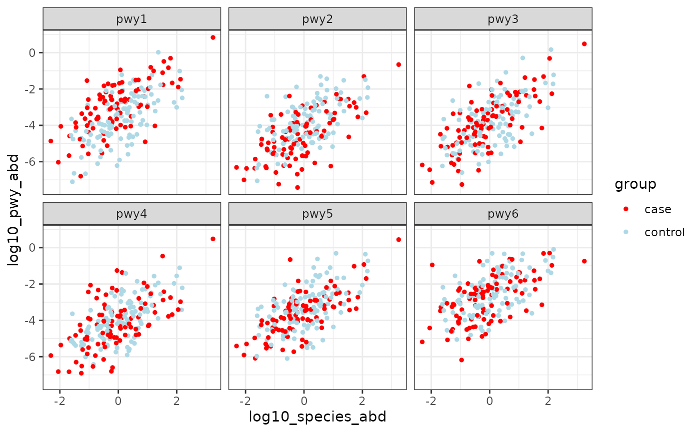

# Pathway Ranef

## Pathway random effects model

The pathway model uses a random effects model applied to the pathways in
a single bug. It looks for pathways that differ substantially in
abundance between two groups while accounting for the correlation with
species abundance. Using the standard `lme4` formula syntax, the model
is:

``` math
 log10(pwy_abd) \sim log10(species_abd) + (1|pwy) + (0 + group|pwy) + intercept
```
The relevant functions to fit the model are
[`anpan_pwy_ranef()`](https://andrewghazi.github.io/anpan/reference/anpan_pwy_ranef.md)
and
[`anpan_pwy_ranef_batch()`](https://andrewghazi.github.io/anpan/reference/anpan_pwy_ranef_batch.md).

A few notes on this model:

- Because we’re working with log abundances, zeros are discarded. (side
  note: we once tried a censored model that didn’t discard zeros but
  instead modeled them as unknown low values. It added a lot of
  complexity and made no practical difference in the results.)
- The relationship between species abundance and pathway abundance is
  measured globally using data from all pathways in the bug.
- each pathway has its own intercept (that’s the `(1|pwy)` term), but
  these intercepts are partially pooled across pathways
  - These terms come from a $`Normal(0, \sigma_{int})`$ distribution.
    The prior on $`\sigma_{int}`$ is a $`t_{5, 0, 2.5}`$ distribution
- each pathway has its own group effect (that’s the `(0+group|pwy)`
  term). These are also pooled across pathways, but they are independent
  of the pathway intercepts (that’s what that `0` is signalling).
  - These terms come from a $`Normal(0, \sigma_{effects})`$
    distribution. The prior on $`\sigma_{effects}`$ is a relatively
    aggressive $`exponential(3)`$ distribution.
- There are some additional weak priors on several parameters. The best
  place to inspect these in the model code itself in the installation
  folder `anpan/stan/pwy_ranef.stan`
  - If you don’t know where this file is located on your system, you can
    use `system.file('stan', 'pwy_ranef.stan', package = 'anpan')` to
    find it.

Some setup:

``` r
library(anpan)
library(data.table)
library(ggplot2)
library(tibble)
library(dplyr)
library(ape)

options(digits = 2)
```

### Simulate data

In this section we’ll simulate pathway level data. For the sake of
simplicity we’ll simulate only 6 pathways, though many bugs usually have
sufficient data for a dozen or more. Throughout this section we’ll
include “log10\_” in the name of some variables because that’s how
they’ll be calculated in practice (by taking logarithms of real
abundance measurments), even though we’re not calculating any logarithms
here.

First we generate the log10 species abundance with a simple call to
`rnorm(n)`:

``` r
n = 200
n_pwy = 6

set.seed(123)

species_abd_df = data.table(log10_species_abd = rnorm(n),
                            group             = sample(c("case", "control"), 
                                                       size = n, 
                                                       replace = TRUE),
                            sample_id         = paste0("sample", 1:n))
```

Here we generate the true effects of the pathway intercepts/effects. We
apply a true pathway effect of +/-0.67 to the first two pathways (these
will be the effects we try to detect) and 0 to everything else.

``` r
pwy_true_params = data.table(pwy              = paste0("pwy", 1:n_pwy),
                             pwy_intercept    = rnorm(n_pwy),
                             pwy_group_effect = c(c(0.67, -0.67),
                                                  rep(0, n_pwy - 2)))
pwy_true_params
```

    ##       pwy pwy_intercept pwy_group_effect
    ##    <char>         <num>            <num>
    ## 1:   pwy1         -0.72             0.67
    ## 2:   pwy2         -0.75            -0.67
    ## 3:   pwy3         -0.94             0.00
    ## 4:   pwy4         -1.05             0.00
    ## 5:   pwy5         -0.44             0.00
    ## 6:   pwy6          0.33             0.00

Then we generate the log pathway abundances. Some things to note:

- We subtract 3 from the lo10_pwy_abd mean as a global intercept just
  because real pathway abundance measurements are usually pretty low
- We put a 0.85 global slope on the linear relationship between pathway
  abundance and species abundance. This implies that the pathways in the
  species aren’t detected as efficiently as the species itself.
- The true pathway effects get applied to the cases in the last line.
  After `mean =`, the four terms in the sum are the four components of
  the linear predictor in the model, i.e. 
  - the global intercept (-3)
  - the global `log10_pwy ~ log10_species` relationship (0.85)
  - the pathway level intercepts
  - the pathway effects applied to cases

``` r
pwy_grid = expand.grid(sample_id = paste0("sample", 1:n),
                       pwy       = paste0("pwy", 1:n_pwy)) |> 
  as.data.table()

bug_pwy_dat = pwy_grid[species_abd_df, on = "sample_id"][pwy_true_params, on = "pwy"]

bug_pwy_dat[, log10_pwy_abd := rnorm(n * n_pwy,
                                     mean = -3 + 
                                            0.85 * log10_species_abd +
                                            pwy_intercept + 
                                            (group == "case") * pwy_group_effect)]
```

Let’s look at a plot of the simulated data:

``` r
bug_pwy_dat |> 
  ggplot(aes(log10_species_abd,
             log10_pwy_abd)) + 
  geom_point(aes(color = group), size = 1) + 
  facet_wrap("pwy") +
  scale_color_manual(values = c("case" = "red", 
                                "control" = "lightblue")) + 
  theme_bw()
```



Both effects are fairly visually obvious. We’ll see how well the model
can detect these effects in the next section.

### Fit the pathway model

We first create a 0/1 indicator variable, then fit the model with
[`anpan_pwy_ranef()`](https://andrewghazi.github.io/anpan/reference/anpan_pwy_ranef.md):

``` r
bug_pwy_dat[, group01 := as.numeric(group == "case")]

pwy_result = anpan_pwy_ranef(bug_pwy_dat = bug_pwy_dat,
                             group_ind = "group01")
```

Our result is a data frame with columns containing the fit and the
summary. Let’s look at the summary:

``` r
pwy_result$summary_df[[1]]
```

    ## # A tibble: 17 × 14
    ##    pwy   hit   variable         mean  median     sd    mad     q5     q95     q1
    ##    <chr> <lgl> <chr>           <dbl>   <dbl>  <dbl>  <dbl>  <dbl>   <dbl>  <dbl>
    ##  1 NA    NA    species_beta…  0.854   0.855  0.0307 0.0301  0.804  0.906   0.785
    ##  2 NA    NA    sigma          1.01    1.01   0.0200 0.0202  0.975  1.04    0.963
    ##  3 NA    NA    sd_pwy_int     0.686   0.619  0.284  0.220   0.367  1.24    0.310
    ##  4 NA    NA    sd_pwy_effec…  0.426   0.398  0.146  0.128   0.242  0.704   0.201
    ##  5 pwy1  NA    pwy_intercep… -0.105  -0.104  0.291  0.264  -0.586  0.380  -0.823
    ##  6 pwy2  NA    pwy_intercep… -0.346  -0.345  0.295  0.265  -0.823  0.134  -1.06 
    ##  7 pwy3  NA    pwy_intercep… -0.271  -0.270  0.296  0.267  -0.759  0.219  -1.00 
    ##  8 pwy4  NA    pwy_intercep… -0.402  -0.403  0.293  0.261  -0.886  0.0735 -1.14 
    ##  9 pwy5  NA    pwy_intercep…  0.180   0.181  0.291  0.257  -0.289  0.669  -0.538
    ## 10 pwy6  NA    pwy_intercep…  0.964   0.959  0.294  0.268   0.502  1.46    0.233
    ## 11 pwy1  TRUE  pwy_effects[…  0.684   0.683  0.143  0.149   0.454  0.918   0.360
    ## 12 pwy2  TRUE  pwy_effects[… -0.539  -0.539  0.142  0.141  -0.775 -0.309  -0.882
    ## 13 pwy3  FALSE pwy_effects[…  0.0512  0.0518 0.133  0.133  -0.165  0.270  -0.256
    ## 14 pwy4  FALSE pwy_effects[… -0.0688 -0.0701 0.133  0.130  -0.289  0.143  -0.377
    ## 15 pwy5  FALSE pwy_effects[… -0.138  -0.137  0.134  0.133  -0.356  0.0742 -0.448
    ## 16 pwy6  FALSE pwy_effects[… -0.107  -0.109  0.130  0.127  -0.323  0.112  -0.403
    ## 17 NA    NA    global_inter… -3.57   -3.57   0.284  0.248  -4.05  -3.10   -4.26 
    ## # ℹ 4 more variables: q99 <dbl>, rhat <dbl>, ess_bulk <dbl>, ess_tail <dbl>

We can see in the `hit` column that pwy1 and pwy2 were both correctly
called as hits.

### Examine the results

There are two functions for plotting the results of the pathway model.
[`plot_pwy_ranef_intervals()`](https://andrewghazi.github.io/anpan/reference/plot_pwy_ranef_intervals.md)
compactly plots 98% intervals for pathways (faceted by bug as
appropriate). It will automatically highlight “hits” (as defined by the
conditions in the help documentation of
[`anpan_pwy_ranef()`](https://andrewghazi.github.io/anpan/reference/anpan_pwy_ranef.md))
in red.

``` r
plot_pwy_ranef_intervals(pwy_result)
```


The next plotting function is
[`plot_pwy_ranef()`](https://andrewghazi.github.io/anpan/reference/plot_pwy_ranef.md).
This creates a plot of the data overlaid with posterior draws of the
estimated species:pwy relationship by pathway.

``` r
plot_pwy_ranef(bug_pwy_dat   = bug_pwy_dat,
               pwy_ranef_res = pwy_result,
               group_ind     = "group01",
               group_labels  = c("control", "case"))
```

    ## Warning in plot_pwy_ranef(bug_pwy_dat = bug_pwy_dat, pwy_ranef_res =
    ## pwy_result, : Couldn't determine the bug name from inputs, setting a
    ## placeholder.


You can see the clear visual separation between the two groups in the
first two bugs, while the draws from the other four pathways tend to
overlap.
